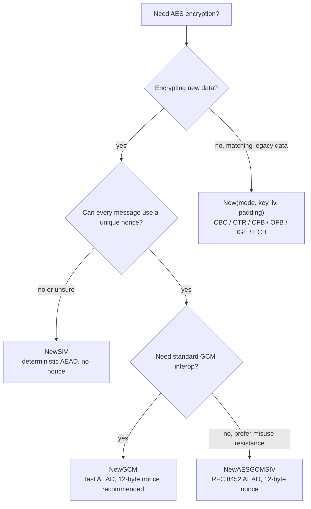

# aes-go

[](https://pkg.go.dev/github.com/colduction/aes-go)
[](https://goreportcard.com/report/github.com/colduction/aes-go)


`aes-go` is a compact Go package for AES encryption. It keeps the modern AEAD APIs close at hand while still offering classic AES modes and padding helpers for interoperability work.

> [!NOTE]
> **Info:** Start with an authenticated mode for new systems. `NewSIV`, `NewAESGCMSIV`, and `NewGCM` protect both confidentiality and integrity.

## Install

```sh
go get github.com/colduction/aes-go
```

## Choose an API



| Use case | API | Authentication | Nonce or IV | Padding |
| --- | --- | --- | --- | --- |
| Easiest safe default | `aes.NewSIV` | Yes | None | No |
| Nonce-misuse-resistant AEAD | `aes.NewAESGCMSIV` | Yes | 12-byte nonce | No |
| Standard AEAD interoperability | `aes.NewGCM` | Yes | 12-byte nonce recommended | No |
| GHASH-backed deterministic SIV | `aes.NewGHASHSIV` | Yes | None | No |
| Legacy block/stream modes | `aes.New` | No | Mode-specific IV | Optional |

> [!WARNING]
> Classic modes such as CBC, CTR, CFB, OFB, IGE, and ECB do not authenticate ciphertext. Add a MAC or use an AEAD mode unless a legacy protocol already defines the complete construction.

## Quick Start

### AES-SIV

AES-SIV is deterministic authenticated encryption. It does not need a nonce, and decryption fails if the ciphertext or additional data changes.

```go
package main

import (
	"fmt"
	"log"

	"github.com/colduction/aes-go"
)

func main() {
	key, err := aes.GenerateSIVKey(aes.SIVKeySize256)
	if err != nil {
		log.Fatal(err)
	}

	aead, err := aes.NewSIV(key)
	if err != nil {
		log.Fatal(err)
	}

	plaintext := []byte("hello")
	metadata := []byte("user:42")

	ciphertext := aead.Seal(nil, nil, plaintext, metadata)

	decrypted, err := aead.Open(nil, nil, ciphertext, metadata)
	if err != nil {
		log.Fatal(err)
	}

	fmt.Println(string(decrypted))
}
```

> [!IMPORTANT]
> `NewSIV` reports `NonceSize() == 0`, so pass `nil` as the nonce to `Seal` and `Open`.

### AES-GCM

AES-GCM is fast and widely supported. Generate a fresh nonce for every message encrypted with the same key.

```go
key, err := aes.GenerateKey(aes.KeySize256)
if err != nil {
	log.Fatal(err)
}

seedNonce := make([]byte, 12)
aead, err := aes.NewGCM(key, seedNonce, nil)
if err != nil {
	log.Fatal(err)
}

nonce, err := aes.GenerateRandomBytes(aead.NonceSize())
if err != nil {
	log.Fatal(err)
}

metadata := []byte("user:42")
ciphertext := aead.Seal(nil, nonce, []byte("hello"), metadata)

plaintext, err := aead.Open(nil, nonce, ciphertext, metadata)
if err != nil {
	log.Fatal(err)
}
```

> [!CAUTION]
> Reusing a GCM nonce with the same key can break confidentiality and authentication. Store or transmit the nonce beside the ciphertext.

### AES-GCM-SIV

AES-GCM-SIV keeps an AEAD shape while reducing the damage from accidental nonce reuse.

```go
key, err := aes.GenerateKey(aes.AESGCMSIVKeySize256)
if err != nil {
	log.Fatal(err)
}

aead, err := aes.NewAESGCMSIV(key)
if err != nil {
	log.Fatal(err)
}

nonce, err := aes.GenerateRandomBytes(aes.AESGCMSIVNonceSize)
if err != nil {
	log.Fatal(err)
}

metadata := []byte("user:42")
ciphertext := aead.Seal(nil, nonce, []byte("hello"), metadata)

plaintext, err := aead.Open(nil, nonce, ciphertext, metadata)
if err != nil {
	log.Fatal(err)
}
```

<details>
<summary>CBC compatibility example with PKCS#7 padding</summary>

```go
package main

import (
	"log"

	"github.com/colduction/aes-go"
	"github.com/colduction/aes-go/padding"
)

func main() {
	key, err := aes.GenerateKey(aes.KeySize256)
	if err != nil {
		log.Fatal(err)
	}

	iv, err := aes.GenerateIV()
	if err != nil {
		log.Fatal(err)
	}

	c, err := aes.New(aes.ModeCBC, key, iv, padding.PKCS7)
	if err != nil {
		log.Fatal(err)
	}

	ciphertext, err := c.Encrypt([]byte("hello"))
	if err != nil {
		log.Fatal(err)
	}

	plaintext, err := c.Decrypt(ciphertext)
	if err != nil {
		log.Fatal(err)
	}

	_ = plaintext
}
```

</details>

## Key Sizes

| Constant | Bytes | Purpose |
| --- | ---: | --- |
| `aes.KeySize128` | 16 | AES-128 |
| `aes.KeySize192` | 24 | AES-192 |
| `aes.KeySize256` | 32 | AES-256 |
| `aes.SIVKeySize128` | 32 | AES-128-SIV |
| `aes.SIVKeySize192` | 48 | AES-192-SIV |
| `aes.SIVKeySize256` | 64 | AES-256-SIV |
| `aes.GHASHSIVKeySize128` | 16 | AES-128-GHASH-SIV |
| `aes.GHASHSIVKeySize192` | 24 | AES-192-GHASH-SIV |
| `aes.GHASHSIVKeySize256` | 32 | AES-256-GHASH-SIV |
| `aes.AESGCMSIVKeySize128` | 16 | AES-128-GCM-SIV |
| `aes.AESGCMSIVKeySize256` | 32 | AES-256-GCM-SIV |

Use `aes.GenerateSIVKey` for `SIVKeySize*` constants. Use `aes.GenerateKey` for standard AES, GHASH-SIV, and AES-GCM-SIV constants that are 16, 24, or 32 bytes.

## Classic Modes

| Mode | IV requirement | Notes |
| --- | --- | --- |
| `aes.ModeCBC` | 16 bytes | Needs padding for most plaintext. |
| `aes.ModeCFB` | 16 bytes | Stream-like compatibility mode. |
| `aes.ModeCTR` | 16 bytes | Never reuse the same key and IV pair. |
| `aes.ModeECB` | None | Legacy-only; leaks repeated blocks. |
| `aes.ModeIGE` | 32 bytes | Compatibility mode for protocols that require IGE. |
| `aes.ModeOFB` | 16 bytes | Stream-like compatibility mode. |

> [!WARNING]
> Avoid `ModeECB` for new data. It reveals patterns in plaintext and is included only for compatibility.

## Padding

Padding helpers live in a subpackage:

```go
import "github.com/colduction/aes-go/padding"
```

Available schemes:

| Padding | Typical use |
| --- | --- |
| `padding.PKCS7` | Default choice for AES-CBC, AES-ECB, and AES-IGE compatibility. |
| `padding.PKCS5` | Legacy PKCS#5 interoperability. |
| `padding.X923` | ANSI X9.23 interoperability. |
| `padding.ISO7816` | ISO/IEC 7816-4 style padding. |
| `padding.ISO10126` | Legacy randomized padding. |
| `padding.Bit` | Bit padding compatibility. |
| `padding.TBC` | Trailing bit complement padding. |
| `padding.Zero` | Zero padding when the protocol can disambiguate trailing zero bytes. |

## Safety Checklist

- [ ] Generate keys with `aes.GenerateKey` or `aes.GenerateSIVKey`.
- [ ] Generate IVs and nonces with `aes.GenerateIV` or `aes.GenerateRandomBytes`.
- [ ] Prefer `NewSIV`, `NewAESGCMSIV`, or `NewGCM` for new designs.
- [ ] Treat additional data as authenticated metadata and pass the same value to decrypt.
- [ ] Never reuse a GCM nonce with the same key.
- [ ] Never reuse a CTR, CFB, or OFB key/IV pair.
- [ ] Avoid ECB unless a legacy protocol requires it.

> [!TIP]
> Keep keys out of source code and logs. Load them from a secret manager, KMS, or another environment-specific secret source.

## License

This project is released under the MIT License. See [LICENSE](LICENSE).
